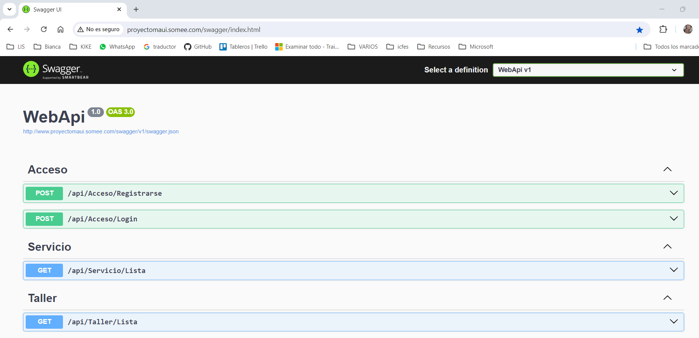
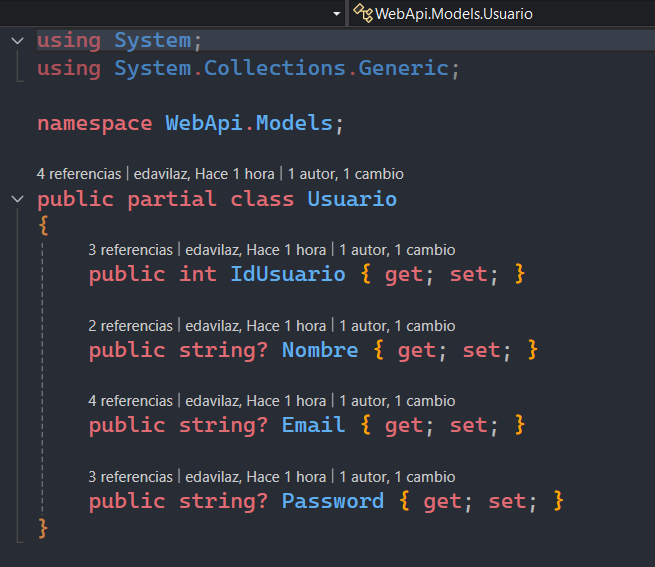
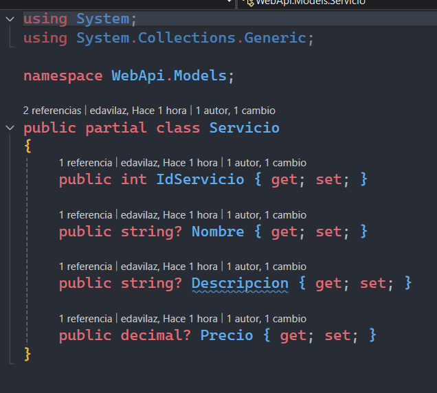
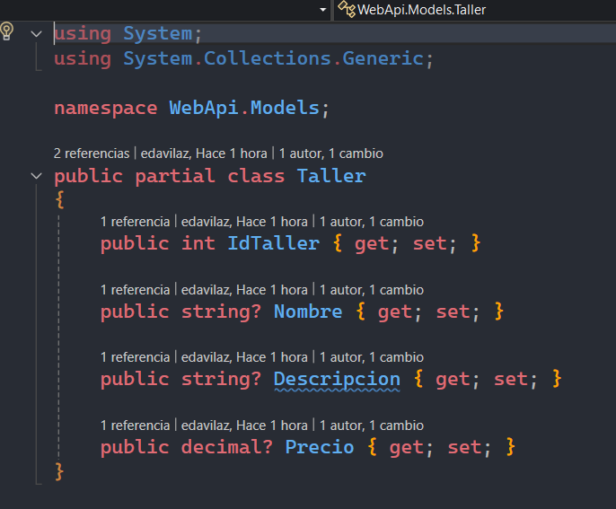
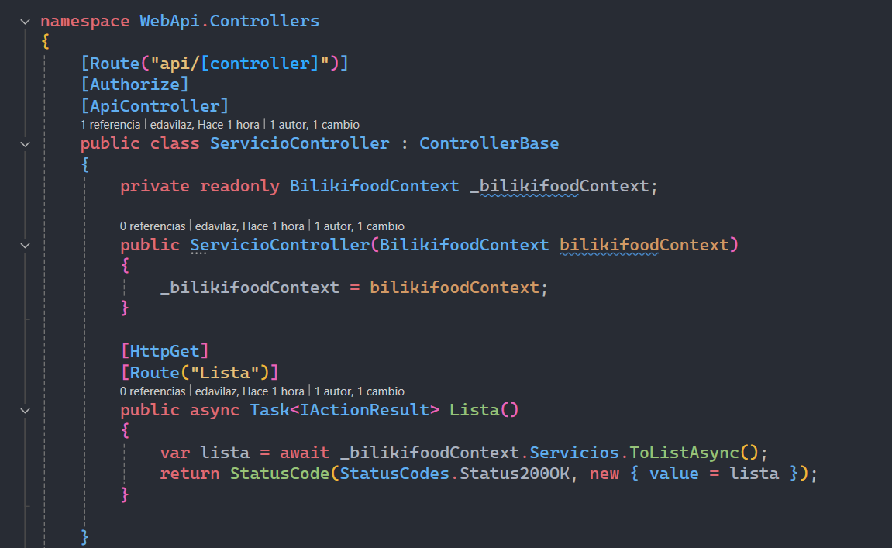
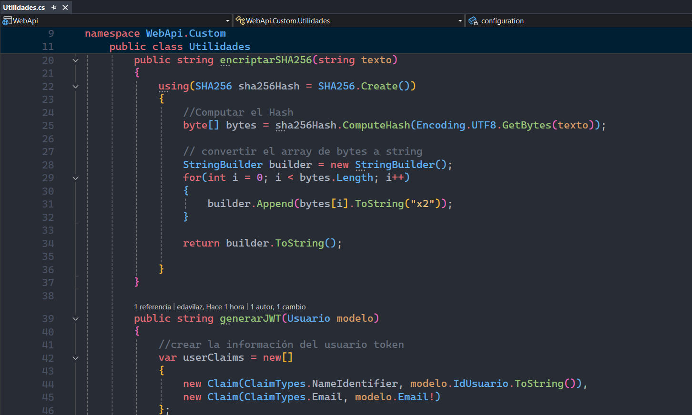
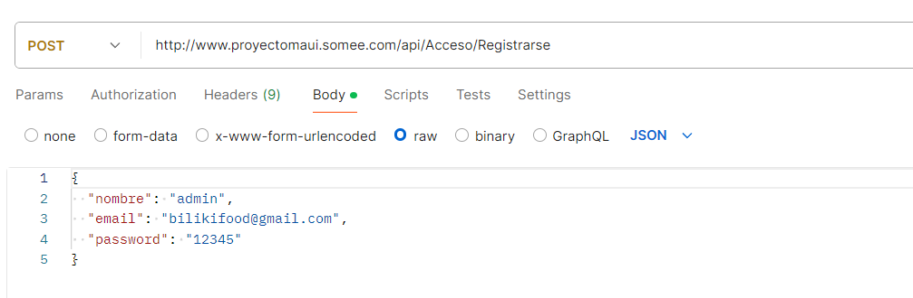
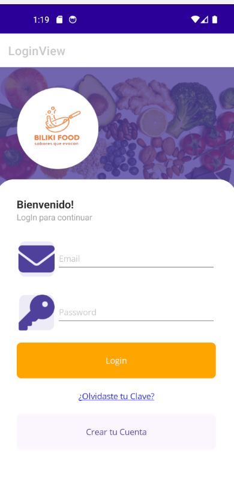
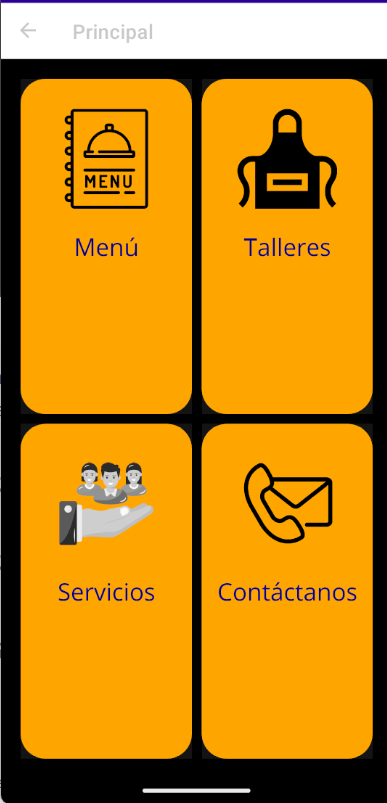
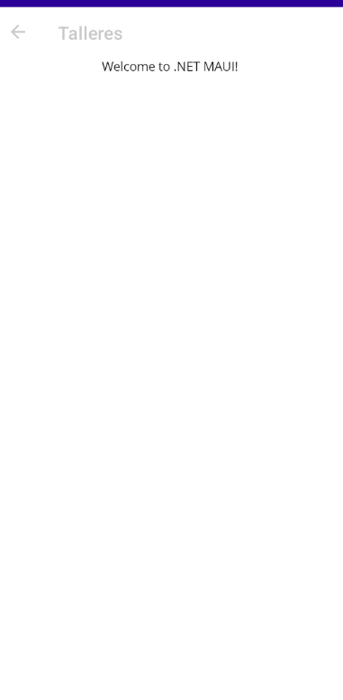

# **Proyecto Desarrollo de Aplicaciones Móviles Híbridas**

## Descripción del Proyecto

El presente proyecto es realizado en :NET Maui en su versión 8.0 utilizando como IDE Visual Studio.Se realiza la muestra de una aplicación que actualmente se viene actualizando.

Al final se logrará, La interacción en la aplicación, en esta primera actividad se realizó el Proyecto, dividido en dos:

1. Proyecto API, el cual quedó completamente conectado a un servidor gratuito, para posteriormente ser usado en la app de MAUI.

2. El proyecto en MAUI, que aún está con la parte de FrontEnd realizada, que posteriormente se agregará la lógica para que se pueda ver la interacción.

## WEBAPI

Se tiene realizada la API realizada en .NET 8.0, en la misma se creó lo siguiente:

Se realizó una conexión a una base de datos sqlServer, ya que todo se hizo de esta manera para poder montarlo en un servidor gratuito mediante el siguiente link:

[http://www.proyectomaui.somee.com/swagger/index.html](http://www.proyectomaui.somee.com/swagger/index.html)

### Detalles

En el proyecto WEBAPI, se tiene la siguiente división:

## Carpeta Models

Es la que se utilizó para crear las clases que con las cuales se crearon las tablas de la base de datos: Usuario, Taller, Servicio. Posteriormente, se crean LoginDTO, y UsuarioDTO, los cuales se usan para posteriormente mostrar los datos en la API.

Se crea también el DBContextx, mediante el cual se logra la conexión a la base de datos y la creación de la Base de datos y la creación de las tablas.

Además una muestra de uno de los controladores, que por el momento sólo tienen el método GET, ya que la página está pensada para mostrar datos y no se permitirá modificaciones, por el usuario.

En el mismo se usa [Authorize], que logra que la aplicación utilice la lógica del archivo utilidades, para lograr usar un token, para registrarnos, mediante el login, si no ocurre esto, no se verán los listados de servicios.

En la carpeta del proyecto, se adjunta también una colección de Postman, la cual ya tiene los métodos para poder realizar el procesos, de registro, Login y posteriormente de ingreso para ver los listados ya sea de Servicios o Talleres.

## Explicación POSTMAN

Para verificar que funciona la API, se tiene los siguientes pasos:

1. Registro

2. Login Incorrecto

3. Login Correcto

4. Lista Servicios

5. Lista Talleres

## Aplicación en MAUI

El proyecto de desarrollo realizado en MAUI, tiene la siguiente estructura:

Por el momento presenta una lógica básica, en la cual se puede ingresar al login, pero aún falta la conexión completa con la api. Las siguientes son las imágenes de la aplicación:

### Pantalla de login con la cual inicia la aplicación

En la cual uno podrá, registrarse o logear.

### Pantalla del menú

La pantalla que se mostrará a quien se loguee, se permitirá ver los servicios, los talleres o se dará el ingreso a un formulario de contacto.

### Otras

Las otras página aún están sin terminar porque falta terminar la lógica para que se puedan ver los listados de los servicios y de los talleres que se ofrecerán.

Esta parte aún en construcción.

## Desarrollador

[Jaime Enrique Dávila Zuazo](https://edavilaz.github.io/)

